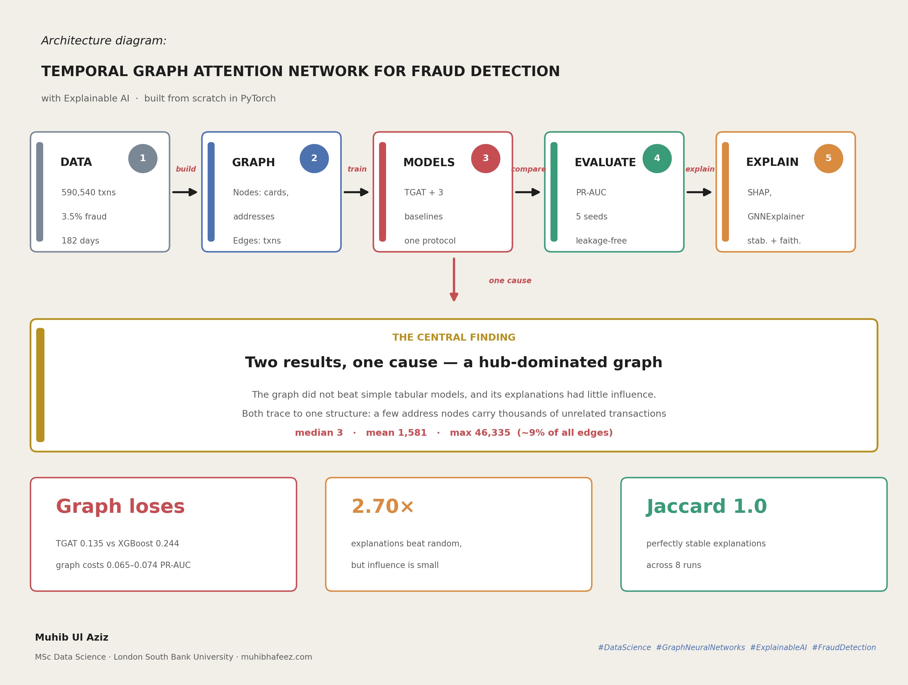
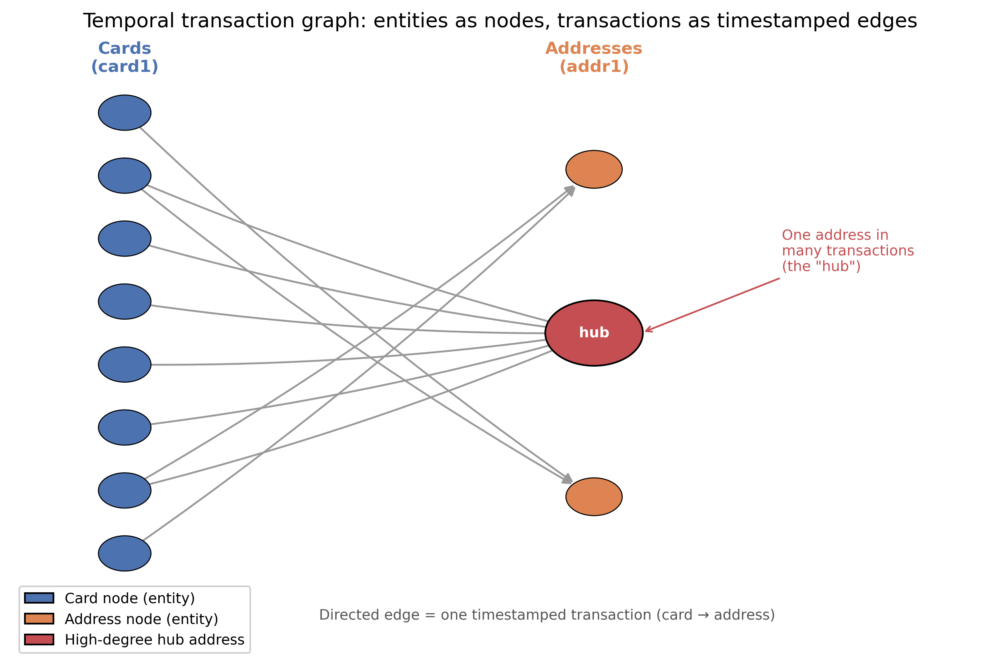
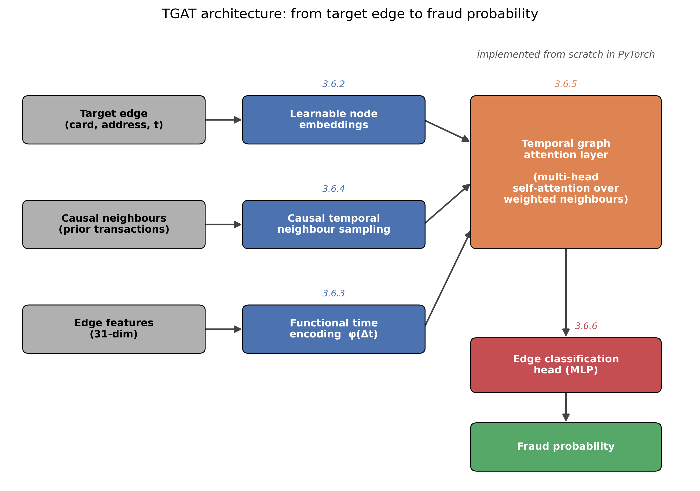
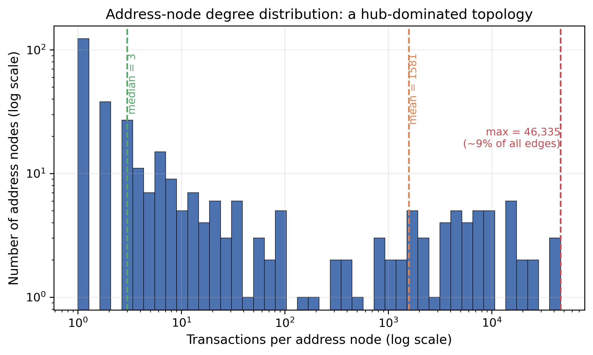
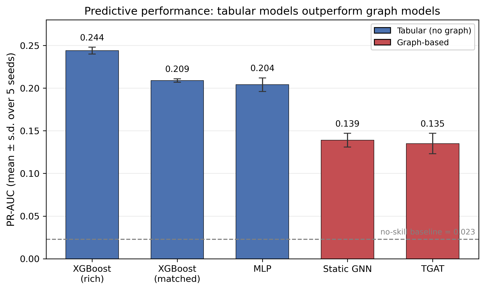
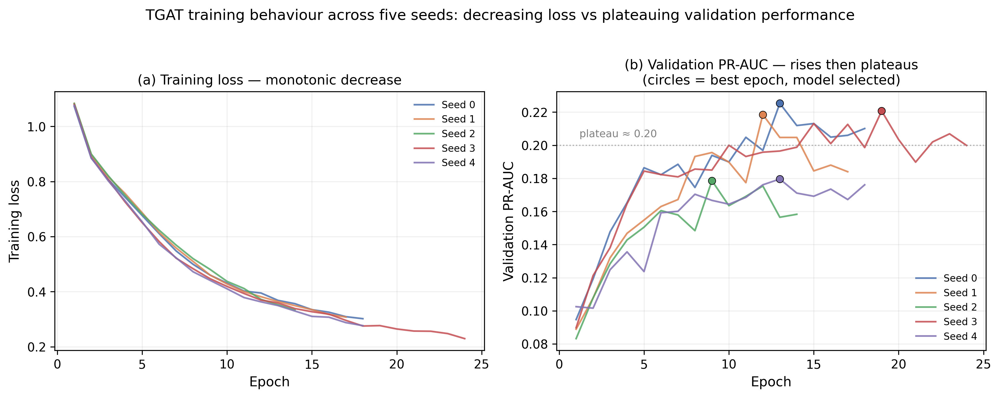
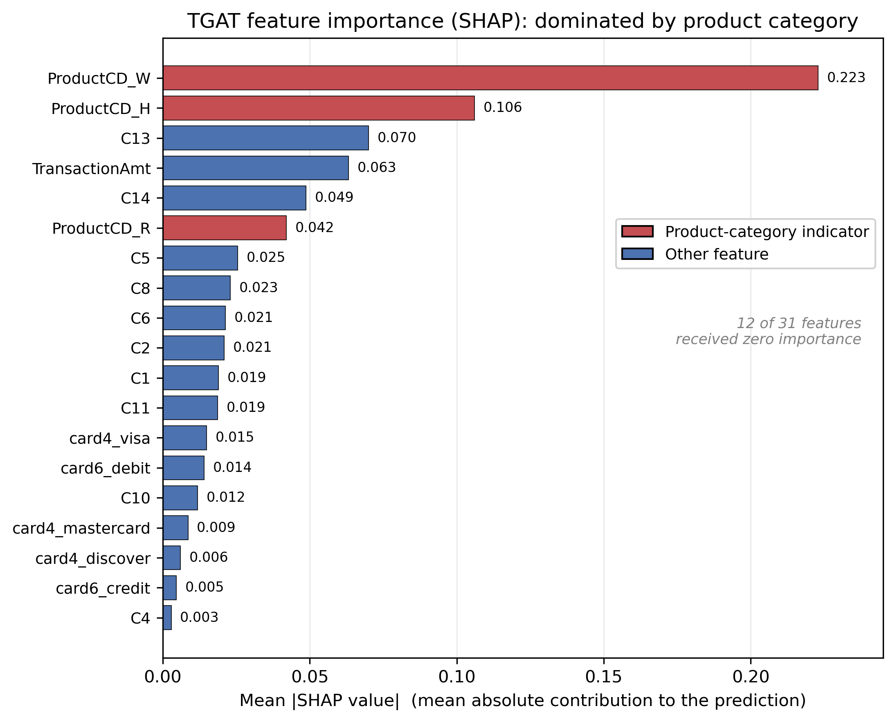
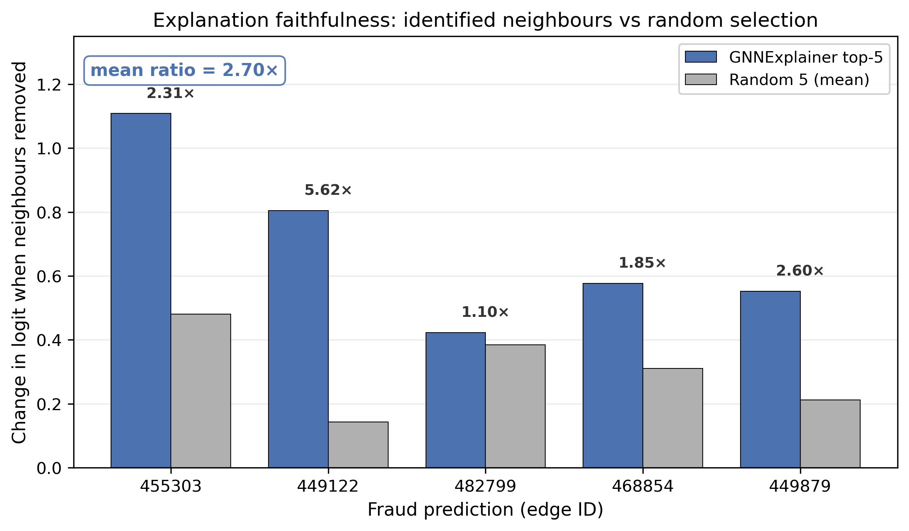

# Results

Saved outputs and figures backing every number reported in the dissertation.

---

## Overview

---

## Method

**The graph formulation** — cards and billing addresses are nodes; each
transaction is a timestamped, directed edge. Fraud detection becomes a
temporal edge-classification task.

**Model architecture** — the TGAT, built from scratch in PyTorch.

---

## Key Findings

**1. The graph is hub-dominated.** A few address nodes carry a huge share of
all transactions (median 3, mean 1,581, max 46,335 — about 9% of all edges).
This structure is the root cause of both main results.

**2. The graph models lose.** At identical features, the graph costs
0.065–0.074 PR-AUC versus strong tabular baselines. Removing the temporal
component changed nothing.

**3. Training shows mild overfitting.** Training loss falls while validation
PR-AUC plateaus — consistent across all five seeds.

**4. Feature attribution is discriminative.** SHAP concentrates importance in
a few features, dominated by the product category.

**5. Explanations are better-than-random, but of small consequence.** The
neighbours GNNExplainer identifies move the prediction ~2.70× more than random
ones — yet the absolute effect is small, and no prediction ever flips.

---

## Data files

| File | Contents |
|---|---|
| `tgat_seed_results.json` | TGAT test metrics, seeds 0–4 |
| `mlp_static_results.json` | MLP baseline, and the time-ablated GNN |
| `xgb_baselines.json` | XGBoost, matched and rich feature sets |
| `tgat_shap.json` | Global SHAP importance over the 31 edge features |
| `gnnexplainer_results.json` | Per-edge neighbour and feature masks |
| `xai_validation.json` | Faithfulness ablations and stability check |
